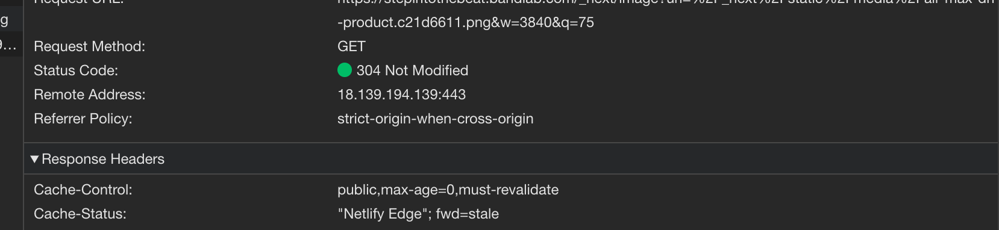
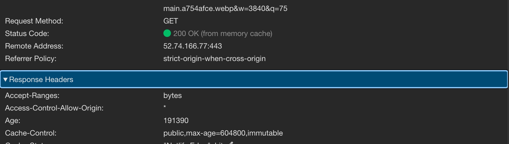

If you are using Next.js with Netlify, you might have experienced a scenario where your static assets are not being cached.



As you can see, the `Cache-Control` header has the max-age property set to 0, which means that the browser will revalidate the asset every time. Luckily, the use of [If-Modified-Since](https://developer.mozilla.org/en-US/docs/Web/HTTP/Headers/If-Modified-Since) prevents the browser from downloading the asset again if it hasn't changed, therefore the CDN only needs to respond with a 304 status code, which saves bandwidth and load time.

For static assets that don't change often, we would prefer to use the local browser cache, not requiring a network call instead. In fact, [by default](public,max-age=604800,immutable), Next.js sets the `Cache-Control` header to `public,max-age=604800,immutable` for [Static Image imports](https://nextjs.org/docs/app/building-your-application/optimizing/images#local-images).

However, when deploying to Netlify, all assets, including local media are served with the headers as shown above. This is due to media being accessed through a Netlify Function/Edge Function which sets the `Cache-Control` header to `public, max-age=0, must-revalidate` [by default](https://docs.netlify.com/platform/caching/#default-values).

To fix this, we can use the `netlify.toml` configuration to modify headers for specific routes. In this case, we want to set custom `Cache-Control` headers for all media assets under `/_next/static/media/*`. To do this, create a `netlify.toml` file in the root of your project and add the following configuration:

```toml
[[headers]]
  for = "/_next/static/media/*"
  [headers.values]
    Cache-Control = "public, max-age=604800, immutable"
```

You should now see the correct headers for your static assets.


